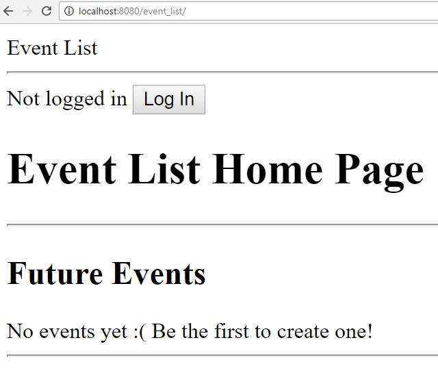
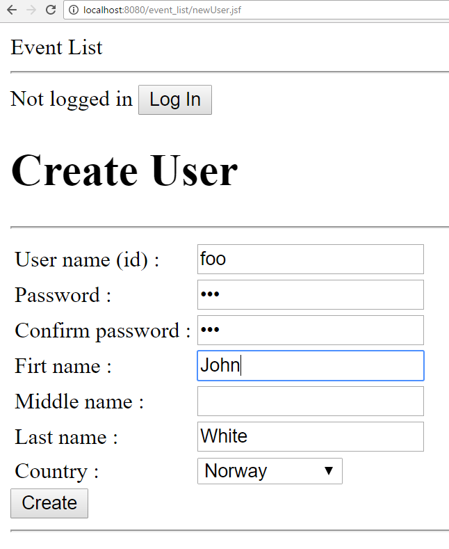

# The EventList Application

In this exercise, you will need to create a basic web application called **Event List** (the actual name
does not really matter…). In short, people can post info about events (eg, a concert or a party), and
users can specify whether they are going to attend to it or not.

The application should be implemented on the JEE stack, eg JPA, JTA, EJB, and JSF. 
The project should be structured in 3 Maven submodules: 
*backend*  (containing Entity, EJB, and all other needed
classes), 
*frontend* (JSF beans and XHTML) and 
*report* (for aggregated JaCoCo report). 

You should use Maven to compile a WAR file that should be deployable on WildFly. You need to
configure Maven to be able to start WildFly and automatically deploy the WAR when running 
`mvn wildfly:run` from the *frontend* folder (after doing a `mvn install` on the root folder). 
You have to use an embedded database (eg H2).

Testing should be based on Arquillian (for EJB) and Selenium (for end-to-end) using Chrome. You
can make the assumption that the Chrome drivers are available under the user's home folder (as
anyway needed to run the examples). 
All tests should be automatically started (and connecting to WildFly if necessary) 
when running `mvn clean install -fae` from the root folder.
Tests should be independent, ie they should not fail based on the order in which they are run, and
neither they should fail if run more than once (e.g., when run several times from IDE without
restarting WildFly).

### The Home Page
You need to create a home page in the file home.xhtml. Your application should have root name
“event_list”. When you start with `mvn wildfly:run`, from you browser writing
“localhost:8080/event_list” should lead to the following:

The header “Event List”, “Not logged it” and the “Log in” should be in a `layout.xml`
template, as it will be reused on all the pages. As the application is just started, no events should be
displayed yet. You need a text message to specify it, eg “No events yet”.

### Test Home Page
You need to create a WebPageIT file with Selenium tests. For now, write one test called
“testHomePage” which simply opens the localhost:8080/event_list URL and verifies it is the
right one (eg, by checking the title of the page).

### Login
Need to create a `login.xhtml` page which is opened when the user clicks on the “Log In” button.
Page should look like:

Once username/password are typed, clicking “Log In” should try to log in. If login fails, should stay on
this page (no need to provide an error message). Clicking on “Cancel” should return to home page.
“Create new” will be discussed later.
Note: for the actual login, you can re-use the same kind of process (and code) used in the
*JEE* examples. However, recall this is very **UNSECURE**.
 
 
### Test Login: Selenium
Create page objects called HomePageObject and LoginPageObject, which will be used when
interacting with the web pages with Selenium. To WebPageIT, add the following two tests:

* testLoginLink: from home page, click on login, and verify it is on the login page (eg check
page title)

* testLoginWrongUser: as above, but here also try to fill a wrong login/password
combination, and verify that after pressing “Log in” the browser still stays on the same page

Note: at this point you cannot test a successful login, as you haven't the code yet to register a new
user.
 
 
### Create New User
Create a page `newUser.xhtml`, which should be reached when clicking “Create new” on the login
page. It should look like:

The values in this form are self-explanatory. The values in the “Country” drop-list should come
from the a predefined set of countries (just choose 5-6). On valid inputs, clicking “Create” should
create a new user, and its data should be mapped to an `@Entity` that will be stored on the embedded
database. With wrong data (eg., user already exist or password is not properly confirmed), clicking
on “Create” should just let the browser stay on same page (no need for error message).
When a new user is created (eg., “Foo”), it will be automatically log in, and the browser should
return to the home page. The header should change now, eg displaying a welcome message
including the username of the logged-in user, plus the “Log in” should turn into “Log out”:

You might notice that now on the home page there is also a “Create Event” button and a “Only
Norway” checkbox. These should only be visible when a user is logged in, and will be discussed in
the next parts.

### Constraints on Users
All the fields in the Entity representing a User do need proper constraints (eg, avoid unbound
strings). You also need to create two custom constraints: `@NotEmpty` for strings, and `@Country` for
the field representing a country (which should re-use the pre-defined list of 5-6 countries you made
before).

### Test Login/User creation: Arquillian
For each public method in the EJB dealing with login and creation of new users, write one
Arquillian test. Furthermore, for each field, explicitly test if the constraint handling is working.

### Test Creation of New Users: Selenium
Add a CreateUserPageObject page object. To WebPageIT, add the following tests:

* testCreateUserFailDueToPasswordMismatch: from home, navigate to the create new user
page. Try to create a new user, but that should fail due to password not confirmed, ie what in
“Password” should not be equal to “ConfirmPassword”

* testCreateValidUser: from home, navigate to the create new user page, and fill the form with
valid data. Do successfully create a new user. Once back on home page, do confirm the user
is actually logged in (eg, check if id appears in the welcome message and that the login
button is gone). Note, to alter the selection in the drop-list, you need to use a command like:
`new Select(driver.findElement(By.id("createUserForm:country"))).selectByVisibleText(country);`

* testLogin: create a new user (see previous tests). From the home page, do logout, and
confirm you are logged out. Click on “Log In”. On the log in page, re-login with the user
you just created. Confirm that, once logged in, the browser goes back to home page, and
user is indeed logged in.

### Creation of New Event
Create a `newEvent.xhtml` page, accessible from the home page when one clicks on the “Create
Event” button. It should look like:

Once “Create” is clicked, the data should be stored with an `@Entity` in the embedded database, and
browser should go back to the home page. In case of error, should stay on current page (no need to
display error messages).
Note: once at least one event is created, those should be displayed in the home page. However,
when creating the very first event from that user, none should be displayed of in a different
country (eg, events in Sweden should not be displayed by default if user is from Norway):

The point is that only events from the same country as the user (in this case Norway) should be
displayed, ie the “Only” checkbox should be on by default. When unchecked, all events from all
countries should be displayed:

Note: who created an event has no bearing on the display of the events.
Note: for now, ignore the “Participants” and “Going” columns.

### New Events: Constraints and Arquillian
Add proper constraints to the Entity representing an event. 
Add Arquillian tests for each public method in the EJB dealing with events.

### Test Creation of New Events: Selenium
Create a page object called CreateEventPageObject. To WebPageIT, add the following tests:

* testCreateOneEvent
  * create and log in a new user (re-use existing page objects)
  * navigate to the create event page, and create a new event in the same country as the username
  * on the home page, do verify that the number of displayed events has been increased by one

* testCreateEventInDifferentCountries
  * create a new user
  * with this user, create two events in two different countries, but one has to be the same as
    the one of the user. For example, if the user is from Norway, create one event in Norway
    and one in Sweden (for example).
  * On the home page, when the “Only” checkbox is off, verify the number of displayed
    events has been increased by 2. When it is on, it should by increased by one. Note: pay
    particular attention on the fact that, when you run this test, you do not know the kind of
    events currently displayed.

* testCreateEventsFromDifferenUsers
  * create a new user
  * create an event
  * logout
  * in the same test, create a second new user
  * create an event
  * verify that both the events are displayed on the home page
  
  
### Event Attendance
For each event, you should keep track of who expressed his/her intention to attend it. Likewise,
should keep track for each user of which events s/he will attend. To represent it, you can use a
many-to-many relation in the `@Entity` files.

When an event is displayed, you should also show the number of users that is going to attend it (ie,
the “Participants” column in the previous screenshots).

When a user is logged in, for each event there should be a checkbox (ie, the “Going” column in the
previous screenshots) to specify whether s/he will attend that particular event. The checkboxes
should be off by default, even for the events created by the same user (ie, the author of an event has
to explicitly click on its checkbox to express the intention s/he is going to the event s/he just
created).
  
  
### Test Event Attendance: Selenium
To WebPageIT, add the following tests:
* testCreateAndAttendEvent
  * create a new user
  * create a new event
  * verify that the “Participants” count for that event is 0
  * click the checkbox to mark this user is going to attend the event
  * verify that the “Participants” count is 1
  * unclick the checkbox
  * verify that the “Participants” count is 0

* testTwoUsersAttendingSameEvent
  * create a new user
  * create a new event
  * attend the event (ie click on check box)
  * verify that the “Participants” count for that event is 1
  * logout
  * create a second user
  * attend the event with this second user
  * verify that the “Participants” count is now 2
  * logout
  * login back with the first user
  * verify that the “Participants” count is still 2
  * uncheck the attendance checkbox
  * verify that the “Participants” count goes down to 1
  
  
### JaCoCo
Configure JaCoCo in such a way that, when running `mvn clean verify`, a test report should be
generated under the `report/target` folder. You need an average instruction coverage of at least
70%. If it is lower, add more tests.  