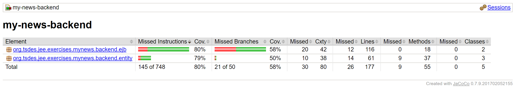
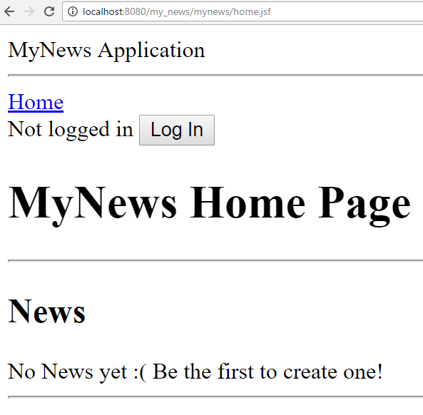
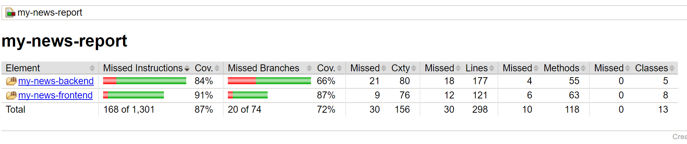

# The MyNews Application

In this exercise, you will need to create a basic web application called **My News** (the actual name
does not really matter…). In short, people can post news, and other users can write comments on
those. In the rest of this text, I will use the terms *post* and *news* interchangeably.

The application should be implemented on the JEE stack, eg JPA, JTA, EJB, and JSF. 
The project should be structured in 3 Maven submodules: 
*backend*  (containing Entity, EJB, and all other needed
classes), 
*frontend* (JSF beans and XHTML) and 
*report* (for aggregated JaCoCo report). 

You should use Maven to compile a WAR file that should be deployable on WildFly. You need to
configure Maven to be able to start WildFly and automatically deploy the WAR when running 
`mvn wildfly:run` from the *frontend* folder (after doing a `mvn install` on the root folder). 
You have to use an embedded database (eg H2).

Testing should be based on Arquillian (for EJB) and Selenium (for end-to-end) using Chrome. You
can make the assumption that the Chrome drivers are available under the user's home folder (as
anyway needed to run the examples). 
All tests should be automatically started (and connecting to WildFly if necessary) 
when running `mvn clean install -fae` from the root folder.
Tests should be independent, ie they should not fail based on the order in which they are run, and
neither they should fail if run more than once (e.g., when run several times from IDE without
restarting WildFly).

### Backend
In the backend module you need to have 3 entities: *User*, *Post* and *Comment*.

* *User* should have the fields representing concepts like: userId, hash, salt, firstName,
middleName, lastName, registrationTime
* *Post* should have a text, the time when it was created, information on who created it. Users
can add comments to posts, and vote for/against them (eg, +1 or -1).
* *Comment*: should extend Post, and add functionality like the boolean possibility of being
moderated (in the GUI, a moderated comment will have its text not displayed, and
replaced with a warning message)

Add adequate/reasonable constraints to all the fields in those entities.

Write EJBs to be able to achieve the following functionality:
* create a user
* login a user
* create a post
* vote for/against a post/comment, and also undo the voting. A user cannot give more than a
+1 to a same post, as well as no more than a -1.
* get all posts sorted by time (most recent first)
* get all posts sorted by voting (highest scores first)
* create a comment for a given post
* moderate (ie set to true its flag) a comment. Only the author of the post is allowed to
moderate its comments.
* calculate the “karma” of a user: this is calculated by the sum of all the scores of all of his/her
posts and comments. Each moderated comment gives an extra “-10” penalty.

### Arquillian Tests For The Backend 
Write Arquillian tests for the EJBs, in two different files, called *UserEJBTest* and *PostEJBTest*.

In *PostEJBTest* you need (in this order) at least the following. 
Names should be hopefully self explanatory…
the actual content is up to you, as long as it is somehow related to the name of the test:

* testCreatePost
* testVoteFor
* testVoteAgainst
* testCannotVoteForTwice
* testCannotVoteAgainstTwice
* testUnvote
* testChangeVote
* testGetAllPostByTime
* testGetAllPostByScore
* testCreateComment
* testModerateOwn
* testFailModerateOther
* testVoteForComment

In *UserEJBTest* you need at least:
* testKarmaWithModeration
  * create a user, a post, and 4 comments for that post
  * downvote the post
  * upvote 2 comments
  * moderate the other 2 comments
  * create a new user, which will upvote one of the non-moderated comments
  * verify that the “karma” of the first user is “-1 + 2 + (-20) + 1 = -18”

When all these tests run from Maven, you should achieve a JaCoCo instruction coverage of at least
50% (see under “backend/target/site/jacoco/index.html”). For example:

### Home Page
The first time you open it, the home page of MyNews should look like:

The header “MyNews Application”, “Home” link, “Not logged it” and the “Log in” button
should be in a *layout.xhtml* template, as they will have to be reused on all the pages. As the
application is just started, no posts should be displayed yet. You need a text message to specify it,
eg “No News yet”.

### Login and Create New Users

You need to implement a base login system, and give the ability of creating new users. 
Note: you can reuse what shown in the **JEE** module, but, recall that it is very **UNSECURE**. 

You will have a page for login
(when clicking on the login button in the headers) and create new users like:

### Create News
Once a user is logged in, and only then, on the home page he should be able to create a news.
Furthermore:

* All news created so far should be displayed
* Each news should have a column showing: Time, Author, News, Score, Your Vote
* Only the first 30 characters of News's text should be visible. If longer than 30, show only the
first 26, followed by “ ...”.
* “Your Vote” should only be visible when a user is logged in (as you need to keep track of
who is voting what, non-logged in users cannot vote), and should contain 3 radio buttons.
When a voting on a post changes, its Score should be updated
* Add option to sort the table by either “Time” or “Score”

See for example:

### Author Details

The userIds in the Post table should be links directing to a new page, showing all the details of a
user, including its karma. For example:

### Selenium Tests
Write Selenium tests in a file called MyNewsIT. Each web page should have a Page Object. You
should write the following tests, in this order:
* testCreateNews
  * create and log in with a new user
  * assert that new user has no News in the home page
  * create a news
  * assert there should be 1 news from that user
  * create another news
  * assert there should be 2 news from that user

* testNewsAfterLogout
  * create and log in with a new user
  * create 2 News
  * assert those 2 posts are visible
  * logout
  * assert those 2 posts are still visible

* testUserDetails
  * create and log in with a new user
  * create a News
  * click on the “author” link of this news
  * verify that the application is led to a new page with the details for that user

* testCanVote
  * create and log in with a new user
  * create a News
  * verify that it is possible to vote for news
  * logout
  * verify that it is NOT possible to vote for news
  * login again with that user
  * verify that it is possible to vote for news

* testScore
  * create and log in with a new user
  * create a News
  * sort posts by time
  * assert that the most recent post has a 0 score
  * upvote the post
  * verify that post has now score +1
  * downvote the post
  * verify that post has now score -1
  * unvote the post
  * verify that post has now score 0

* testScoreWithTwoUsers
  * create and log in with a new user
  * create a post
  * sort post by time
  * upvote that post
  * verify that post has now score +1
  * logout
  * create and log in with a new user
  * upvote the previously created post
  * verify that post has now score +2

* testLongText
  * create and log in with a new user
  * create a post with a long text
  * verify that the text of that post has been properly trimmed

* testSorting
  * create and log in with a new user
  * create a post
  * sort by time
  * upvote the post
  * create another post
  * verify the posts are NOT sorted by score
  * sort by score
  * verify the posts are sorted by score
  * sort by time
  * verify the posts are NOT sorted by score
  
  
### News Details
The texts in the Post table should be links directing to a new page, showing the Post in full (ie who
wrote it, when, and the full text), and also giving the ability to create and vote comments, but only
for logged in users. The author of the post should be able to moderate each single comment. When
moderated, the text of a comment should be replaced with “This comment has been moderated”.
See for example:  

### More Selenium Tests
Add the following Selenium tests to MyNewsIT:
* testCreateComment
  * create and log in with a new user
  * create a post
  * open the details of that post
  * verify the post has no comments
  * create 3 comments
  * verify the post has 3 comments

* testCanModerate
  * create and log in with a new user
  * create a post
  * open the details of that post
  * create a comment
  * verify that the user can moderate comments
  * logout
  * re-open the details of that post
  * verify that a non-logged in user cannot moderate comments
  * go back to home page
  * create and log in with a new user
  * re-open the details of that post
  * verify that a non-author cannot moderate comments
  * logout
  * log in with the first user, author of that post
  * re-open the details of that post
  * verify that the user can moderate comments

* testKarma
  * create and log in with a new user
  * create a post
  * upvote the post
  * open the details of that post
  * create two comments
  * moderate both comments
  * go back to the home page
  * open the details of the author of that post
  * verify that the user has karma “+1 -10 -10 = -19”
  
### JaCoCo
Configure JaCoCo in such a way that, when running “mvn clean verify” from the root folder, a test
report should be generated under the *report/target* folder. You need an average instruction coverage
of at least 80%. If it is lower, add more tests. See for example:
  
  